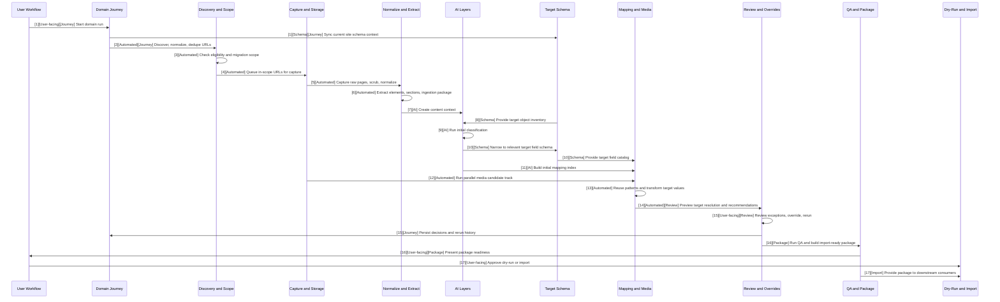

# Content Collector Pipeline Swimlane

## Tag Legend

- `[User-facing]` operator-visible action, approval, or exception review surface
- `[Automated]` deterministic system stage
- `[AI]` model-assisted interpretation, classification, or recommendation stage
- `[Schema]` target-site schema inventory or field catalog stage
- `[Journey]` domain journey logging, freshness, and stage-state tracking
- `[Review]` exception triage, manual overrides, and rerun controls
- `[Package]` QA, readiness, and import-ready package assembly
- `[Import]` downstream dry-run and execution consumers

## V2 User-Facing Workflow

1. Start or select a run against the current WordPress site schema
2. Monitor run progress
3. Review only flagged exceptions
4. Inspect readiness and package status
5. Approve dry-run, import, or export

## V2 Swimlane Diagram

## Changes From The Earlier Outline

- `Domain intake and journey start` is still valid, but it has been expanded to `Domain intake and target schema sync`.
- `URL discovery and normalization` is still valid.
- `URL eligibility and migration scope check` is still valid.
- `Page capture and raw artifact storage` is still valid.
- `Privacy and attribute scrub pass` has been broadened into `Privacy, scrub, and source-normalization transform layer`.
- `Structured extraction and content packaging` is still valid, but now clearly feeds the V2 ingestion package.
- `AI context creation` is still valid.
- `Target object inventory` is still valid.
- `AI initial classification` is still valid.
- `Target field schema catalog` is still valid.
- `AI initial data mapping and indexing` is still valid.
- `Parallel media candidate and mapping track` is still valid.
- `Target entity resolution preview` is still valid.
- `AI finalize recommended mappings` is still valid.
- `Reviewer presentation and decision persistence` has been replaced by a broader `Review by exception, manual overrides, and per-URL reruns` stage.
- `Targeted rerun and freshness validation loop` still exists, but its responsibilities are now split across the review layer, the domain journey subsystem, and QA freshness checks.
- `Downstream dry-run and execution consumers` is still valid, but it now comes after explicit `QA and package validation` and `Build import-ready package` stages.
- New V2 layers added since the earlier outline:
  - `Pattern reuse and learning`
  - `Target-value transformation`
  - `QA and package validation`
  - `Build import-ready package`

## V2 Step Directory

### 1. Domain Intake and Target Schema Sync

Tags:
- `[User-facing]`
- `[Journey]`
- `[Schema]`

What it does:
- starts the domain journey
- snapshots run settings
- syncs the current site's object and schema context before mapping begins

### 2. URL Discovery and Normalization

Tags:
- `[Automated]`
- `[Journey]`

What it does:
- parses sitemaps
- expands nested sitemap sources
- canonicalizes and deduplicates URLs
- assigns stable page identifiers and normalized paths

### 3. URL Eligibility and Migration Scope Check

Tags:
- `[Automated]`

What it does:
- decides which discovered URLs are worth migrating
- filters duplicates, utility pages, or intentionally excluded content

### 4. Page Capture and Raw Artifact Storage

Tags:
- `[Automated]`

What it does:
- fetches HTML and core metadata
- stores raw content evidence
- writes the canonical page artifact and crawl provenance

### 5. Privacy, Scrub, and Source-Normalization Transform Layer

Tags:
- `[Automated]`

What it does:
- applies privacy and scrub rules
- tokenizes or removes risky attributes and noisy values
- normalizes source content before AI interpretation

### 6. Structured Extraction and Content Packaging

Tags:
- `[Automated]`

What it does:
- extracts elements and sections
- stabilizes structured content traces
- produces ingestion-ready payloads for downstream AI and mapping stages

### 7. AI Context Creation

Tags:
- `[AI]`

What it does:
- interprets what each content item is doing for the audience
- produces intent hints for authoring, technical, SEO, and CTA meaning

### 8. Target Object Inventory

Tags:
- `[Schema]`

What it does:
- builds a lightweight inventory of available target object types and taxonomy structures on the current site
- narrows the classification space before field-level mapping

### 9. AI Initial Classification

Tags:
- `[AI]`

What it does:
- classifies each URL into likely target object types and taxonomy contexts
- provides the first strong target-shape recommendation

### 10. Target Field Schema Catalog

Tags:
- `[Schema]`

What it does:
- builds the full target field schema after object-type narrowing
- includes meta, ACF, taxonomies, media-capable fields, and structural constraints

### 11. AI Initial Data Mapping and Indexing

Tags:
- `[AI]`

What it does:
- compares extracted content against the narrowed target schema
- creates candidate field mappings, unresolved items, and mapping evidence

### 12. Parallel Media Candidate and Mapping Track

Tags:
- `[Automated]`

What it does:
- extracts media candidates in parallel with content mapping
- classifies media roles and aligns media to likely target fields

### 13. Pattern Reuse and Learning Layer

Tags:
- `[Automated]`

What it does:
- detects repeatable structures across sibling URLs and similar objects
- reuses successful tendencies to improve consistency and reduce manual review

### 14. Target-Value Transformation Layer

Tags:
- `[Automated]`

What it does:
- converts mapped source content into target-ready values
- shapes content for exact field structures such as repeaters, groups, taxonomies, SEO fields, and media refs

### 15. Target Entity Resolution Preview

Tags:
- `[Automated]`
- `[Review]`

What it does:
- predicts whether the target action is likely `create`, `update`, or `blocked`
- gives reviewers clearer object-level intent before approval

### 16. AI Finalize Recommended Mappings

Tags:
- `[AI]`

What it does:
- consolidates context, classification, mapping, media, pattern reuse, transforms, and entity resolution
- produces one canonical recommendation payload per URL

### 17. Review by Exception, Manual Overrides, and Per-URL Reruns

Tags:
- `[User-facing]`
- `[Review]`
- `[Journey]`

What it does:
- surfaces only blocked, low-confidence, stale, or policy-sensitive cases
- allows target object type overrides, field overrides, and media overrides
- persists reviewer decisions and targeted reruns for individual URLs

### 18. QA and Package Validation

Tags:
- `[Automated]`
- `[Package]`

What it does:
- validates package completeness and target compatibility
- checks required fields, unresolved media, blocked resolutions, stale schema dependencies, and readiness state

### 19. Build Import-Ready Package

Tags:
- `[Automated]`
- `[Package]`

What it does:
- assembles the final package artifacts
- writes the manifest, mapped records, media manifest, QA report, package summary, and package zip

### 20. Downstream Dry-Run and Execution Consumers

Tags:
- `[Import]`
- `[User-facing]`

What it does:
- passes the validated package into dry-run and import consumers
- keeps execution, journaling, and rollback as downstream guardrails instead of the primary product output
