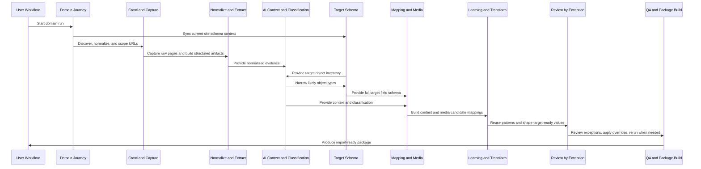

# Migration Mapper V2 Overview

## Purpose

`Migration Mapper V2` is the proposed automation-first mapping and package-generation pipeline for the Content Collector addon.

For the coordinated V2 planning set and recommended reading order, start with:

- `addons/content-migration/docs/MIGRATION_MAPPER_V2_DOC_INDEX.md`

The product goal is:

- crawl any client site for raw content
- interpret and normalize that content automatically
- align it to the current WordPress site's schema
- transform it into target-ready values
- validate the result
- produce an import-ready package as the primary deliverable

In this model, the current WordPress site with the plugin installed is the target environment. If that site uses a framework such as `VerticalFramework` with many CPTs and ACF fields, those structures become the target schema used by V2.

## Product Principle

V2 should feel simpler to the operator because it requires fewer manual actions, not because the internal pipeline has fewer stages.

That means:

- more automation
- review by exception
- progressive disclosure
- preserve context while drilling down
- manual override only when needed
- per-URL rerun controls when automation needs correction
- package output as the primary end result
- calm at first glance, dense only when expanded

## User-Facing Workflow

The operator workflow should be reduced to this:

1. Start or select a run against the current site schema
2. Monitor run progress
3. Review only flagged exceptions
4. Inspect readiness and package status
5. Approve dry-run, import, or export

Everything else should happen inside automated layers and subsystems.

## V2 Principles

1. One canonical recommendation and package pipeline.
   Replace multiple overlapping review lanes with one reviewer-facing model.

2. Deterministic extraction first, AI interpretation second.
   Crawl, extraction, scrub, sections, schema sync, transformation rules, and package assembly should be deterministic where possible.

3. The target site schema is first-class.
   The current WordPress site's CPTs, taxonomies, meta fields, ACF fields, and media-capable fields drive mapping and packaging.

4. Review by exception.
   High-confidence mappings should flow forward automatically. Only blocked, ambiguous, or low-confidence items should require attention.

5. Manual override and rerun remain available.
   Operators must be able to override target object type, field mappings, and media decisions, and rerun automated stages for one URL without restarting the full domain run.

6. The final product is an import-ready package.
   Recommendations are not the end state. They are an intermediate product used to build the package.

7. The UI should behave like a stable run workspace.
   Keep the shell minimal, preserve context while drilling down, and reveal evidence and controls progressively through drawers, inspectors, row expansion, tabs, and accordions.

## Canonical V2 Internal Pipeline

### 1. Domain Intake and Target Schema Sync

What it does:
- starts the domain journey
- records the run context and settings snapshot
- syncs the current WordPress site's object inventory and schema context

Why it exists:
- the target site schema is part of the pipeline from the beginning, not an afterthought

### 2. URL Discovery and Normalization

What it does:
- parses sitemaps
- expands nested sitemaps
- canonicalizes and deduplicates URLs
- assigns stable page identifiers and normalized paths

### 3. URL Eligibility and Migration Scope Check

What it does:
- decides which URLs should continue through the package pipeline
- excludes duplicates, non-migratable pages, utility URLs, or intentionally ignored content

Why it exists:
- reduces noise and keeps review effort focused

### 4. Page Capture and Raw Artifact Storage

What it does:
- fetches HTML and metadata
- stores raw content evidence
- writes the canonical page artifact and crawl provenance

### 5. Privacy, Scrub, and Source-Normalization Transform Layer

What it does:
- applies privacy and attribute scrub rules
- removes or tokenizes risky or noisy values
- performs deterministic normalization needed before AI interpretation

Examples:
- attribute tokenization
- boilerplate suppression
- normalized text blocks
- clean structural traces

### 6. Structured Extraction and Content Packaging

What it does:
- builds elements
- segments sections
- writes ingestion-ready structured content payloads

### 7. AI Layer: Context Creation

What it does:
- interprets what content items are doing for the audience
- emits authoring, technical, SEO, and CTA intent hints

Why it exists:
- separates meaning from field mapping

### 8. Target Object Inventory

What it does:
- creates a lightweight inventory of available target object types and taxonomies on the current site

Why it exists:
- classification should narrow possible targets before full field-level mapping

### 9. AI Layer: Initial Classification

What it does:
- classifies the URL into likely target object types and taxonomy contexts

### 10. Target Field Schema Catalog

What it does:
- builds the full field-level schema only after classification narrowing
- captures meta, ACF, taxonomies, media-capable fields, and structural constraints

### 11. AI Layer: Initial Data Mapping and Indexing

What it does:
- compares structured content items against the narrowed target schema
- builds candidate mappings and unresolved lists

### 12. Parallel Media Candidate and Mapping Track

What it does:
- extracts and classifies media candidates
- aligns media to likely target fields and roles

Why it exists:
- media should remain first-class, not hidden inside generic content mapping

### 13. Pattern Reuse and Learning Layer

What it does:
- detects repeatable patterns across sibling URLs and similar object types
- reuses successful mapping tendencies to improve consistency and reduce manual review

Examples:
- repeated service page sections
- repeated location blocks
- repeated staff profile structures
- repeated CTA or hero patterns

### 14. Target-Value Transformation Layer

What it does:
- converts mapped source content into target-ready values
- shapes content for the current site's exact field structures

Examples:
- HTML cleanup and field shaping
- taxonomy normalization
- repeater and group shaping
- SEO/meta shaping
- media reference normalization

### 15. Target Entity Resolution Preview

What it does:
- predicts whether the target action is likely:
  - create new
  - update existing
  - blocked by ambiguity

Why it exists:
- reviewers need to know what object the package intends to affect, not just which fields are mapped

### 16. AI Layer: Finalize Recommended Mappings

What it does:
- consolidates context, classification, mapping, media, pattern reuse, transformations, and entity resolution
- produces one canonical recommendation payload

### 17. Review by Exception, Manual Overrides, and Per-URL Reruns

What it does:
- surfaces only low-confidence, blocked, or policy-sensitive cases
- allows manual overrides, including target object type override
- allows rerunning specific layers for an individual URL

### 18. QA and Package Validation

What it does:
- validates package completeness and target compatibility
- checks unmapped required fields, unresolved media, stale schema, and blocked items

Why it exists:
- package quality should be measured before import, not discovered during import

### 19. Build Import-Ready Package

What it does:
- assembles the target-adapted package
- writes manifest, mapped records, media manifest, QA report, and package summary

This is the primary V2 output.

### 20. Downstream Consumer Stages

These remain important, but they are downstream of the package:

- dry-run handoff
- import plan generation
- guarded execution
- rollback and run history

## Recommended V2 Pipeline Diagram

## Automation Goals

V2 should automatically handle:

- URL discovery and dedupe
- target schema sync
- structured extraction
- context creation
- initial classification
- candidate mapping and media alignment
- pattern reuse across similar URLs
- target-value transformations
- package QA validation
- package assembly

The operator should mostly handle:

- exceptional mapping cases
- explicit overrides
- optional reruns on one URL or one stage
- final approval for import or export

## Main V2 Decision

The V2 system should be designed around this promise:

`crawl source content -> automatically build a target-ready package -> only ask the user for help when confidence, policy, or ambiguity require it`
