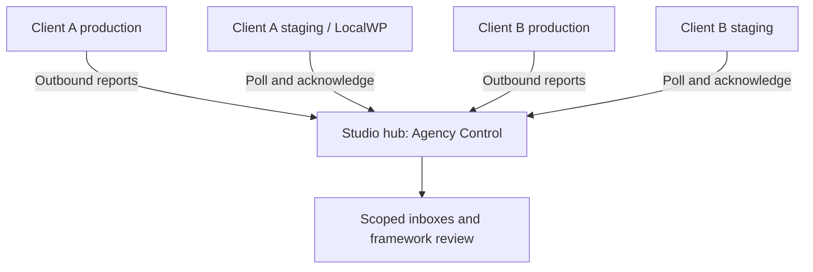

# Architecture: one repository, separate runtime roles

Decision date: 2026-09-16. Supersedes the earlier two-repository architecture. This is a modular DBVC extension, not a rewrite of DBVC or the Visual Editor.

| Owner | Proposed destination | Responsibility |
|---|---|---|
| Connector | `addons/connected-environments/` | Capture orchestration, dirty work, outbox, enrollment, outbound transport, inbox, local status |
| Hub | `addons/agency-control/` | Clients/environments, subscriptions, framework review, receipt/delivery, comparisons, later release coordination |
| Shared contract types | `includes/Dbvc/ConnectedProtocol/` | Small versioned DTO/interfaces and pure comparison contracts; no network, WP registration, global service locator or database access |
| Existing Bricks owner | Current `addons/bricks/` or narrow connector adapter after discovery | Domain storage semantics, individual object identity mapping, dependency interpretation, later supported prepare/apply |
| Existing DBVC owners | Existing core services | Import/export, UID resolution, proposals, backup/recovery |
| Visual Editor | Existing add-on | Optional editing and journal context; never a reporting prerequisite |

Shared protocol code must load independently of connector activation. Hub-only installations should run without Bricks or Visual Editor. The connector uses domain adapters only when prerequisites exist. Unsupported domains show unavailable coverage while other domains continue.

## Runtime matrix

| Connector | Hub | Intended deployment | New behavior |
|---|---|---|---|
| Off | Off | Ordinary DBVC installation | Gate reads only; no feature workers/routes/assets |
| On | Off | Client production/staging/LocalWP | Local reporting and outbound connection |
| Off | On | Dedicated studio hub | Scoped intake, registry and review |
| On | On | Explicit disposable lab or deliberate dual-role installation | Independent identities/stores and no implicit self-subscription |

An emergency constant stops module runtime before loading its services. Settings UI integration remains deliberate and bounded. Defaults are false; absent settings must not create tables or options on every public request.

## Topology

Logical deliveries are stored at the hub and retrieved over each environment's outbound connection. The hub does not call a laptop's `.local` address. A hub running only on LocalWP cannot receive hosted reports while unreachable. Use a dedicated hosted hub for the server pilot; initially use a fully disposable local lab.

## Dependency rules

- Connector and hub depend on the contract layer; neither depends on the other's active bootstrap.
- Connector adapters call reviewed DBVC services, not admin controllers or Visual Editor screens.
- Hub coordinates; it never writes a remote DB or duplicates the importer.
- Existing DBVC behavior does not depend on either new add-on being enabled.
- Existing Bricks mothership/client settings keep their meaning. New environment roles do not repurpose them.
- One plugin ZIP is a packaging choice, not a security or process boundary. PHP fatal errors in loaded code still affect the host installation; gate loading and regression coverage matter.

No new frontend framework, PHP framework, external queue, daemon, AI API, or standalone contracts repository is required for the first pilot. Use DBVC's supported PHP versions and existing admin UI tooling. Future AI explanations cannot supply authorization or invent dependency certainty.
